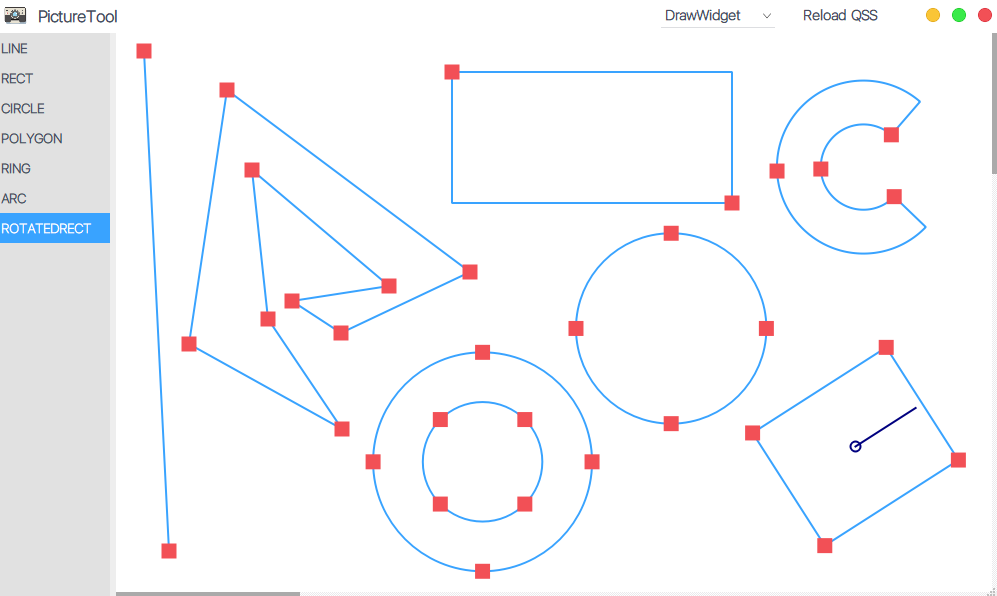

# AppTools  

## [English Description](README_en.md)  

图片资源等来自于互联网。  
本代码仓库，仅供学习，若被他人用于商业用途 与本人无关！ 请遵守许可证！  

## 公用的库最新的在app-pri文件夹中

环境：Qt5.15.0	Visual Studio 2019  

UI参考：[ 应用模版 ](https://github.com/xtuer/template-app/tree/master/template-qt "xtuer/template-app")  

1. PictureTool：基于Qt  Graphics View Framework框架写的看图和绘制简单图形的简易框架；  

2. app-pri：一套UI模板以及一些小工具合集；    

3. app-subdir：基于QtCreator的插件系统写的应用（子工程），功能与app-pri类似并不复杂，主要学习QtCreator的插件系统 ；  

4. MediaPlayer ：超级简约十分简单的多媒体播放器；  

   

### 使用方法：  

1. 先编译构建；  

2. 把源码`bin`文件夹复制到编译出来的可执行文件所在目录（源码`bin-32(64)/debug(release)/`）；  

3. 将`bin/sql`目录下的[apptools.sql](bin/sql/apptools.sql)导入MySql数据库，或者把整个sql文件夹放入可执行程序目录，使用SQLite3数据库；  

4. 在可执行程序路径下（`bin-32(64)/debug(release)/`）新建`translator`文件夹，用QtCreator工具-外部-Qt语言家发布翻译到`translator`文件夹；  

5. 启动程序。  

   

### 界面展示：  

1. #### PictureTool：  

   1. ##### 看图界面：  
   
   

  
   
   2. ##### 简单图形绘制界面  

   

  
   
2. #### app-pri（app-subdir类似）  
   
   

  
   
   

  
   
3. #### MediaPlayer  

   

  
   
   

  
   