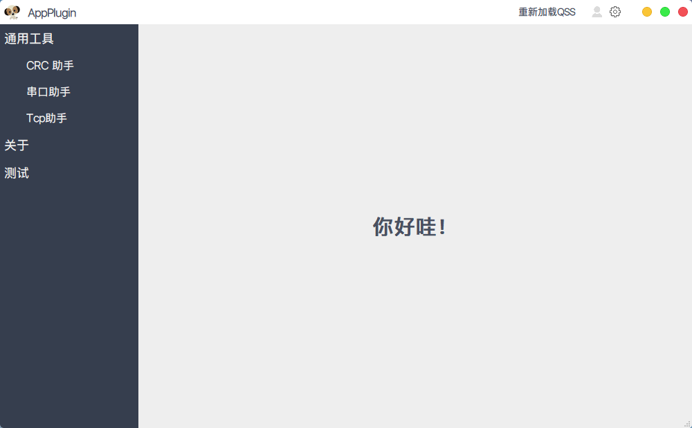

# AppTools  

## [中文说明](README.md)  

Picture resources and so on come from the Internet.  
This code repository is for learning only. If it is used by others for commercial purposes, it has nothing to do with me! Please observe the license!  

Surroundings: Qt5.15.0	Visual Studio 2019  

UI Reference: [ Application template ](https://github.com/xtuer/template-app/tree/master/template-qt "xtuer/template-app")  

1. PictureTool: Details of a simple framework for viewing pictures and drawing simple graphics based on the Qt Graphics View Framework;  

2. app-pri:  A set of UI templates and a collection of gadgets;    

3. app-subdir:  The application (sub-project) written based on QtCreator's plug-in system has similar functions to app-pri and is not complicated. It mainly learns the QtCreator's plug-in system;  

   

### Instructions:  

1. Compile and build first;  
2. Copy the source code`bin`folder to the directory where the compiled executable file is located（`bin-32(64)/debug(release)/`）；  
3. Import [apptools.sql](bin/sql/apptools.sql) under the `bin/sql` directory into the MySql database, or put the entire sql folder into the executable program directory and use the SQLite3 database;  
4. Create a new `translator` folder under the executable program path (`bin-32(64)/debug(release)/`), and use the QtCreator tool-External-Qt Linguist to publish the translation to the `translator` folder; 

5. Starting program.  

   

### Interface display：  

1. #### PictureTool：  

   1. ##### Picture interface：  
   
   

  
   
   2. ##### Simple graphical drawing interface  

   

  
   
2. #### app-pri（app-subdir similar）  
   
   

  
   
   

  
   