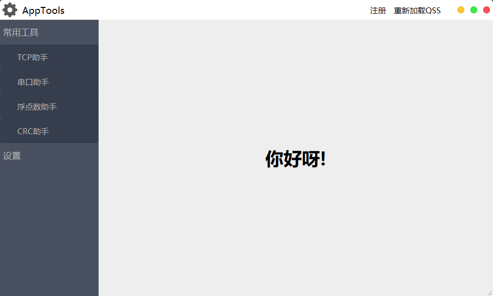

# app-pri  
1. 先编译构建；  
2. 把[源码bin文件夹](AppTools/bin)复制到编译出来的可执行文件所在目录(`源码路径bin-64(32)/debug(release)/`)；  
3. 将`bin/sql`目录下的[apptools.sql](bin/sql/apptools.sql)导入MySql数据库，或者把整个sql文件夹放入可执行程序目录, 使用SQLite数据库；    

1. Compile and build first;  
2. Copy the [source bin folder](AppTools/bin) to the directory where the compiled executable file is located (`source path bin-64(32)/debug(release)/`);  
3. Import [apptools.sql](bin/sql/apptools.sql) under the `bin/sql` directory into the MySql database, or put the entire sql folder into the executable program directory, use SQLite database;   

> 支持MYSQL和SQLITE数据库  
> Support MYSQL and SQLITE database  

程序内部配置，可根据实际情况修改[config.json](bin/cfg/config.json)     

The internal configuration of the program can be modified according to the actual situation [config.json](bin / cfg / config.json)    

然后运行，先显示  

Then run, display first  

## 登录界面 login interface ##   

  
用户名和密码均为`admin`  
Username and password are both `admin`  

登陆成功显示主界面`你好呀！`  
Successful login shows the main interface `Hello! `  

## 主界面 Main interface ##

  